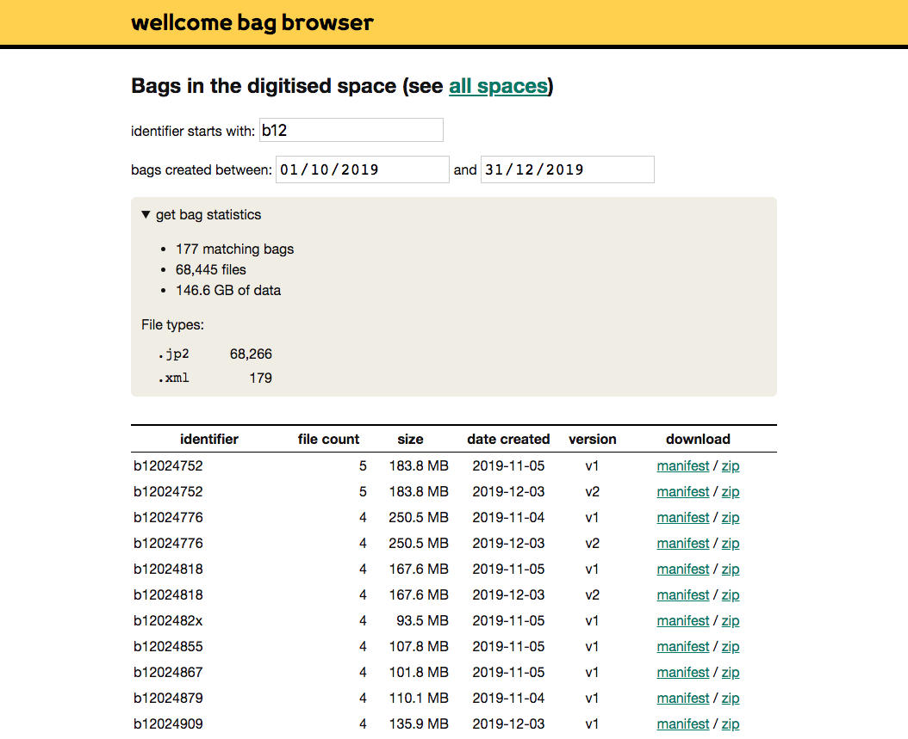

# bag-browser

This is a proof-of-concept browser for bags stored in the [Wellcome Storage Service][service].
It allows you to:

*   See all the bags in a given space
*   Filter for bags matching a particular identifier, or that were saved in a given data
*   Get statistics for all the bags matching a filter: how many bags, how much data, how many files they contain, and what the files types are
*   Download a complete bag as a ZIP file

This is what it looks like:



[service]: https://github.com/wellcometrust/storage-service


## Installation

1.  Clone this repository from GitHub:

    ```console
    $ git clone https://github.com/wellcomecollection/bag-browser.git
    ```

    Make sure you know where the repository has been saved.

2.  Install [Python 3](https://www.python.org/downloads/) on your computer.
    You need Python 3.6 or later.

3.  Install [tox](https://pypi.org/project/tox/), an automated command runner for Python:

    ```console
    $ pip3 install --user tox
    ```

4.  Get some AWS credentials that have read access to the *wellcomedigitalstorage* account.

5.  (Optional) Get a copy of the `bags.db` database from somebody else who already has it locally.
    You can build a copy yourself, it just takes a while.


## Usage

### Running the app

In a terminal, use `cd` to navigate to the repository, then run `tox -e serve`:

```console
$ cd /path/to/bag-browser
$ tox -e serve
```

This will start the app running on <http://localhost:3197>.

You may need to select an AWS profile to be able to download bags; if so, run:

```console
$ AWS_PROFILE=storage-readonly tox -e serve
```

### Refreshing the database of bags

The app uses a local database to keep track of bags, but this doesn't update automatically.

To update the local database, run the following command in your terminal:

```console
$ AWS_PROFILE=storage-readonly tox -e freshen_db
```

This will pull down any new bags to your local database, which should take a few minutes (depending on how long since you last pulled changes).

If you don't have a local database yet, this command will recreate it from scratch (but beware, that takes a *very* long time).


## Other docs

*   [Developing the app](docs/development.md) – if you want to run tests, debug the app
*   [Known issues](docs/known-issues.md) – things I know I need to fix
*   [Implementation notes](docs/implementation.md) – how is the app put together?


## License

MIT.
